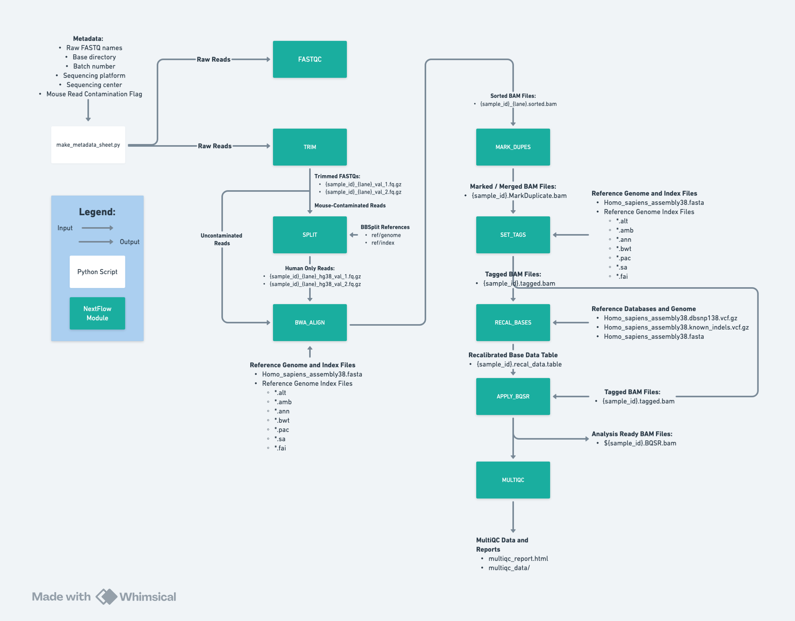
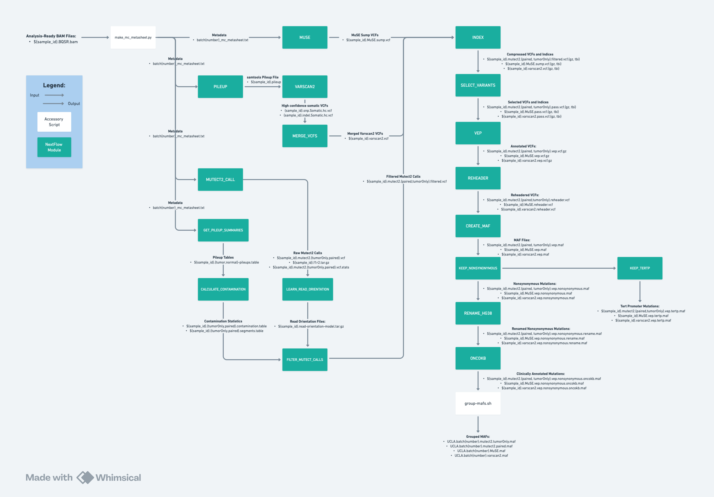
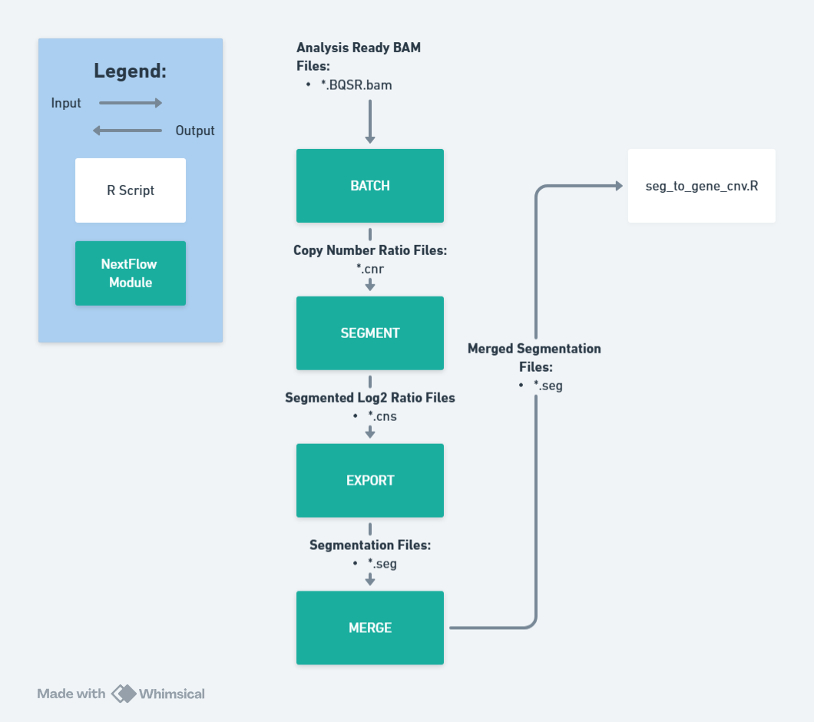
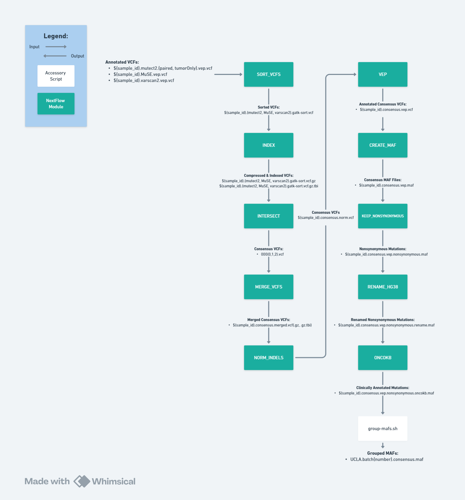

# 🧬 WESley: Whole Exome Sequencing Pipeline

## Overview
**WESley** is a modular [Nextflow](https://www.nextflow.io/) pipeline designed for analyzing **whole exome sequencing (WES)** data. It automates **data preprocessing**, **somatic mutation calling**, and **copy number variation (CNV)** analysis from raw FASTQ files of patient-derived tumor samples. The pipeline maintains HIPAA-compliance and reinforces reproducible workflows to support ongoing neuro-oncology research at UCLA.

---
## Workflow Diagrams
### Data Processing


### Mutation Calling


### Copy Number Calling


### Consensus Calling


## How To Run (Data Processing)

### 1. Generate the Metadata Sheet

Use the `make_metadata_sheet.py` script to generate a `.tsv` metadata file required for downstream Nextflow processes.

```bash
python make_metadata_sheet.py \
-f "/path/to/batch-18/raw_fastqs" \
-b 18 \
-p "Illumina_NovaSeq6000" \
-s "TCGB" \
-m "/path/to/sequencing-metadata.xlsx" \
-o "/path/to/batch-18/metadata/"
```

**Script Parameters:**
| Flag | Description |
|------|-------------|
| -f   | Directory containing raw FASTQ files |
| -b   | Batch number |
| -p   | Sequencing platform (e.g., Illumina_NovaSeq6000) |
| -s   | Sequencing center (e.g., TCGB) |
| -m   | Path to metadata prep sheet (Excel .xls) |
| -o   | Output directory for the generated .tsv |

### 2. Run Data Processing Workflow:
```bash
nextflow run data_processing.nf --with-docker -with-trace \
--base_dir /path/to/batch-18/ \
--ref_dir /references \
--metadata /path/to/batch-18/metadata/batch18_metadata_sheet.tsv \
--batch_name "wes-18" \
--cpus 35
```

**Script Parameters:**

| Flag            | Description |
|-----------------|-------------|
| `--with-docker` | Enables Docker container usage |
| `-with-trace`   | Generates trace logs for resource usage and execution profiling |
| `--base_dir`    | Base directory for batch data (e.g., `wes-batch-18`) |
| `--ref_dir`     | Directory containing reference genomes and annotation databases |
| `--metadata`    | Path to the metadata sheet generated by `make_metadata_sheet.py` |
| `--cpus`        | Number of CPUs to allocate for each process |
| `--batch_name`  | Name of the batch for output organization |

## How To Run (Mutation Calling)

### 1. Generate the Metadata Sheet

Use the `make_mc_metasheet.py` script to generate a `.tsv` metadata file required for downstream Nextflow processes.
* NOTE: Ensure normal BAMs are stored in the ../bam_dir/normals folder

```bash
python make_mc_metasheet.py \
--base_dir /path/to/batch-18/ \
-b 18 \
-o ./path/to/batch-18/metadata \
-m /path/to/sequencing-metadata.xlsx
```

**Script Parameters:**
| Flag      | Description |
|-----------|-------------|
| --base_dir | Base directory of where the BAM files are found (eg: `/path/to/wes-batch-18`) |
| -b        | Batch number |
| -m        | Path to metadata prep sheet (Excel .xls) |
| -o        | Output directory for the generated .tsv |

### 2. Run Mutation Calling:

```bash
# Set OncoKB API token via Nextflow secrets (only needs to be used once)
nextflow secrets set ONCOKB_API_KEY "your_actual_API_token"

# Run the pipeline
nextflow run mutation_calling.nf --with-docker -with-trace \
--base_dir "/path/to/batch-18" \
--batch_number 18 \
--app_dir "/app"
```

**Script Parameters:**

| Flag             | Description |
|------------------|-------------|
| `--with-docker`  | Enables Docker container usage |
| `-with-trace`    | Generates trace logs for resource usage and execution profiling |
| `--base_dir`     | Base directory for batch data (e.g., `wes-batch-18`) |
| `--ref_dir`      | Directory containing reference genomes and annotation databases |
| `--metadata`     | Path to the metadata sheet generated by `make_metadata_sheet.py` |
| `--cpus`         | Number of CPUs to allocate for each process |
| `--batch_number` | Batch number |
| `--app_dir`      | Directory to all the Java JARs / accessory software (eg: Mutect2.wdl) |

## How To Run (CNV Calling)

```bash
nextflow run cnvkit.nf \
--with-docker -with-trace \
--bam_dir /path/to/batch20-bams/ \
--output_dir /path/to/batch20-outputs/ \
--ref_dir /references \
--batch_name 20
```

**Script Parameters:**
| Flag             | Description |
|------------------|-------------|
| --bam_dir        | BAM file directory |
| --output_dir     | Directory to publish outputs |
| --batch_name     | Batch name for output renaming |
| --ref_dir        | Path to the references folder |
| --cpus           | Number of CPUs to allocate (Default: 1) |

## How To Run (Consensus Calling)
```bash
# Set OncoKB API token via Nextflow secrets (only needs to be used once
# This can be skipped if already done from Mutation Calling workflow)
nextflow secrets set ONCOKB_API_KEY "your_actual_API_token"

# Run the pipeline
nextflow run consensus_calling.nf --with-docker -with-trace \
--base_dir "/path/to/batch-18" \
--ref_dir "/path/to/references" \
--cpus 30
```

**Script Parameters:**

| Flag             | Description |
|------------------|-------------|
| `--with-docker`  | Enables Docker container usage |
| `-with-trace`    | Generates trace logs for resource usage and execution profiling |
| `--base_dir`     | Base directory for batch data (e.g., `wes-batch-18`) |
| `--ref_dir`      | Directory containing reference genomes and annotation databases |
| `--cpus`         | Number of CPUs to allocate for each process |
| `--batch_number` | Batch number |

## Requirements

### System Requirements
- **Memory**: 64 GB RAM recommended
- **Storage**: At least 2 TB free space per 10-sample batch
- **CPU**: Multi-core processor (32 cores minimum is recommended)

### API Requirements
- **OncoKB API Token**: An [API token](https://www.oncokb.org/api-access) is required from OncoKB
  - NOTE: The token expires every 6 months

### Software Dependencies

#### General
| Software        | Version  | Purpose |
|-----------------|----------|---------|
| Nextflow        | 25.04.6  | Workflow management |
| Docker          | 18.09.7  | Containerization |
| Python          | 3.6.10   | Scripting and automation |
| R               | 4.3.1    | Statistical analysis |
| Ubuntu          | 20.04    | Shell & data manipulation |

#### Data Processing
| Software        | Version  | Purpose |
|-----------------|----------|---------|
| Trim Galore     | 0.6.6    | Adapter trimming |
| Cutadapt        | 2.8      | Sequence trimming |
| BBMap           | 38.06    | Read mapping and QC |
| SAMtools        | 1.10     | BAM file manipulation |
| BWA             | 0.7.17   | Read alignment |
| FastQC          | v0.11.9  | Quality control |
| MultiQC         | v1.30    | Quality control aggregation |

#### Mutation Calling 
| Software        | Version  | Purpose |
|-----------------|----------|---------|
| GATK / Mutect2  | 4.2.0.0  | Variant calling |
| Ensembl VEP     | 106 + 103 Cache      | Variant annotation |
| vcf2maf.pl      | 1.6.19   | VCF to MAF conversion |
| MuSE            | v1.0rc   | Somatic mutation detection |
| Openjdk/Java (Mutect2)    | 11.0.1  | Java runtime environment |
| Openjdk/Java (VarScan2)    | 11.0.27  | Java runtime environment |
| Cromwell        | 60       | Mutect2.wdl execution |
| OncoKB          | 3.0.0    | Clinical annotation |
| VarScan         | v2.4.3   | Variant detection |
| bcftools  | 1.10.2 | BCF file manipulation |

#### Copy Number Calling
| Software        | Version  | Purpose |
|-----------------|----------|---------|
| CNVKit  | 0.9.10  | Copy Number Calling |

#### Consensus Calling
| Software        | Version  | Purpose |
|-----------------|----------|---------|
| Ensembl VEP     | 106 + 103 Cache      | Variant annotation |
| vcf2maf.pl      | 1.6.19   | VCF to MAF conversion |
| OncoKB          | 3.0.0    | Clinical annotation |
| bcftools  | 1.10.2 | BCF file manipulation |

### Requirements to Run
- Ensure the proper references and metadata are downloaded
- Docker, Nextflow, and Java 11.0.1 installed on a conda environment
  - conda install conda-forge/label/cf201901::openjdk=11.0.1
  - conda install bioconda::nextflow=24.10.5
  - conda install conda-forge::docker
- FASTQ files need to be compressed (.gz)
- Install cromwell-60.jar, gatk-package-4.2.0.0-local.jar, and mutect2.wdl in `$app_dir`
- Pull all Docker images
  - `$ cd containerization/`
  - `$ docker compose pull`

### Resource Management
The pipeline automatically scales resource allocation based on available system resources. Monitor system usage during execution and adjust `--cpus` parameter as needed.

## Outputs

### Primary Outputs
* The pipeline generates results organized similarly to the following directory structure:
```
base_dir/
├── preprocessing/
│   └── analysis_ready_bams/
│       └── {sample_id}.BQSR.bam
├── QC/
│   └── multiqc_data/
│   └── multiqc_report_{date}.html
├── mutation_calls/
│   ├── varscan2/
│   │   ├── oncokb_annotation/
│   │   │   └── {sample_id}.oncokb.maf
│   │   └── vep_annotation/
│   │   │   └── {sample_id}.vep.vcf
│   │   └── raw-vcfs/
│   │       └── {sample_id}.vcf

│   ├── mutect2/
│   │   ├── oncokb_annotation/
│   │   │   └── {sample_id}.oncokb.maf
│   │   └── vep_annotation/
│   │   │   └── {sample_id}.vep.vcf
│   │   └── raw-vcfs/
│   │       └── {sample_id}.vcf
│   └── muse/
│   │   ├── oncokb_annotation/
│   │   │   └── {sample_id}.oncokb.maf
│   │   └── vep_annotation/
│   │   │   └── {sample_id}.vep.vcf
│   │   └── raw-vcfs/
│   │       └── {sample_id}.vcf
│   └── consensus/
│   │   ├── oncokb_annotation/
│   │   │   └── {sample_id}.oncokb.maf
│   │   └── vep_annotation/
│   │   │   └── {sample_id}.vep.vcf
│   │   └── raw-vcfs/
│   │       └── {sample_id}.vcf

└── cnv_calling/
    └── segmentation/
        └── {sample_id}.seg
```

**Key Output Files:**

| File Type | Location | Description |
|-----------|----------|-------------|
| **Analysis-ready BAMs** | `preprocessing/analysis_ready_bams/` | Quality-controlled, recalibrated BAM files ready for variant calling |
| **VEP-annotated VCFs** | `mutation_calls/{caller}/vep_annotation/` | Variant calls annotated with Variant Effect Predictor |
| **OncoKB-annotated MAFs** | `mutation_calls/{caller}/oncokb_annotation/` | Mutation calls in MAF format with OncoKB clinical annotations |
| **Segmentation files** | `cnv_calling/segmentation/` | Copy number variant segments in SEG format |

### Logs
All execution logs and resource usage reports:
- `trace.txt` - Detailed execution trace with resource usage
- `timeline.html` - Interactive execution timeline
- `report.html` - Comprehensive pipeline execution report
- `nextflow.log` - Main pipeline log file

## Troubleshooting

### Getting Help
1. Check the Nextflow log: `tail -f .nextflow.log`
2. Review process-specific logs in `work/` directories
    - `cat .command.log`: Entire log of stdout for specific task
    - `cat .command.err`: Error log for the specific task
    - `cat .command.run`: The actual bash script that was executed
    - `ls -al`: Check for all files in the work directory
3. Validate input metadata format matches expected schema
4. Ensure Docker containers can access mounted directories
5. Ensure `reference` and `app` folders are downloaded and accessible via Nextflow params

## Contributors
- **Dien Ethan Mach** - Pipeline development and maintenance
- **Cassidy Andrasz** - Testing and optimization
- **Henan Zhu** - Original pipeline development

---

**For questions or support, please contact:** dienethanmach@gmail.com