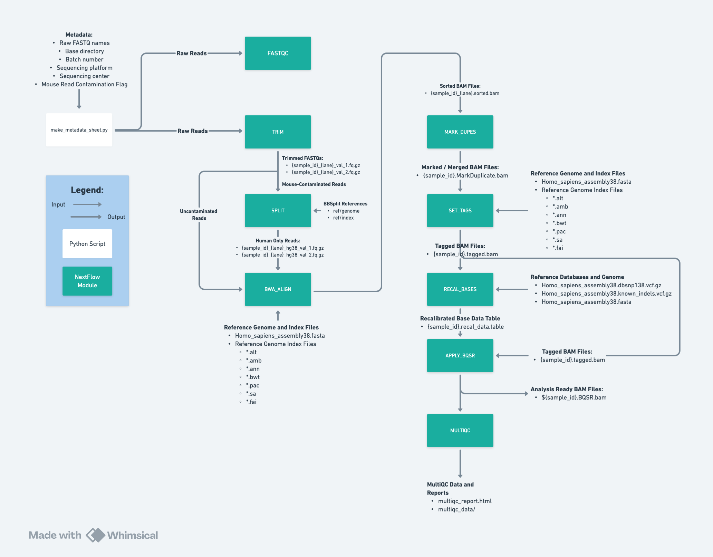
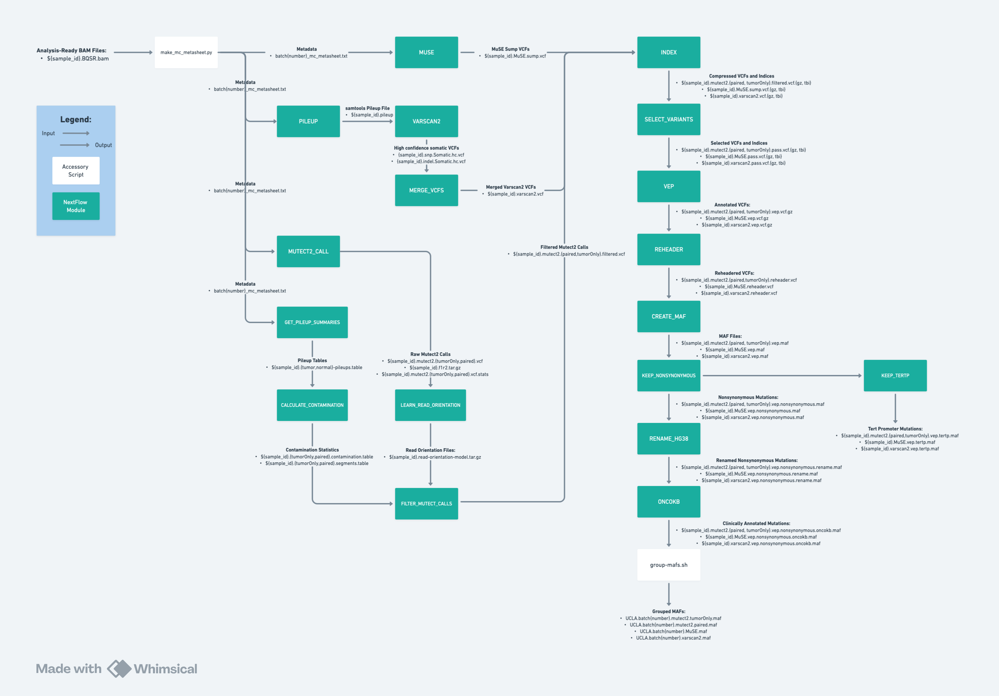
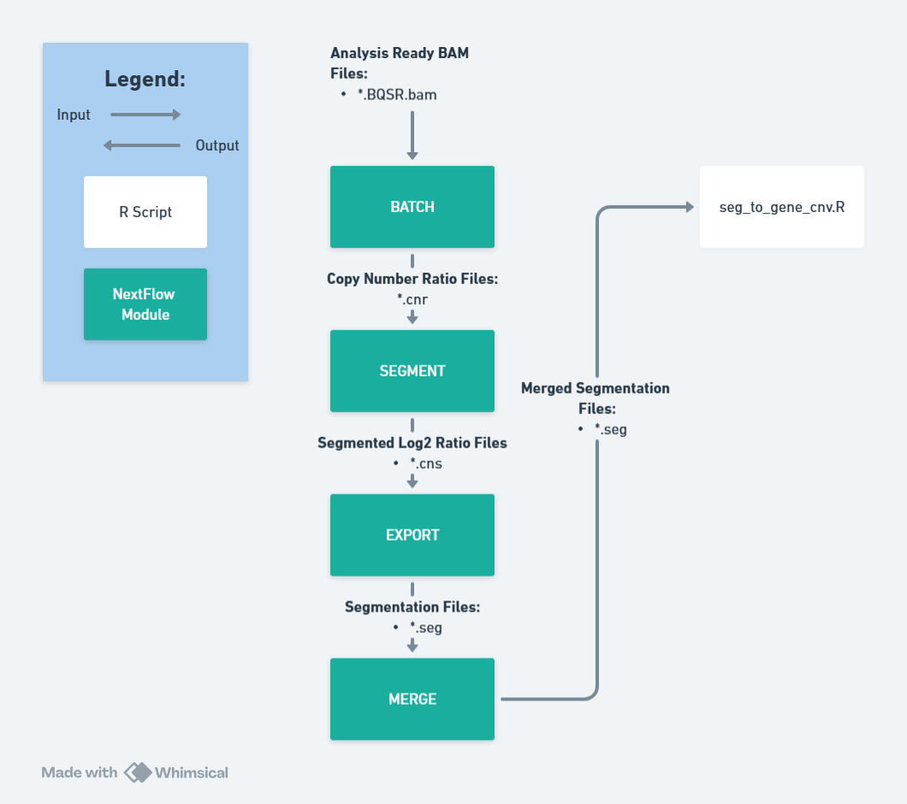
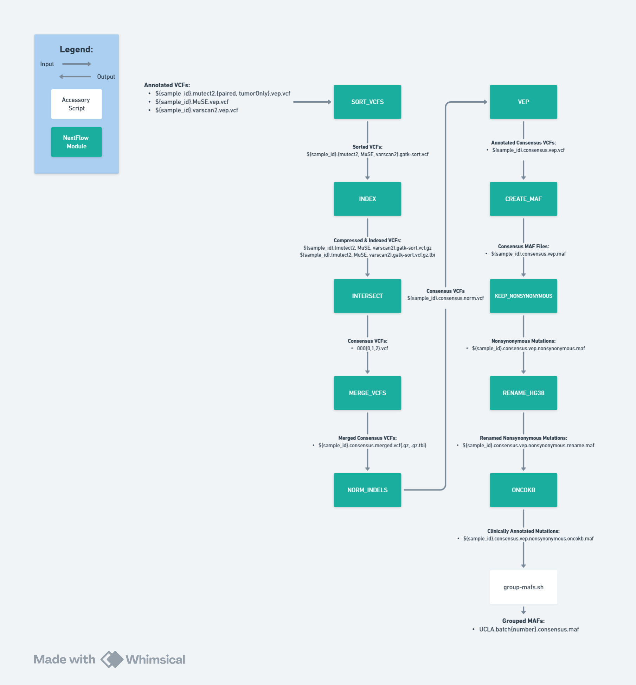
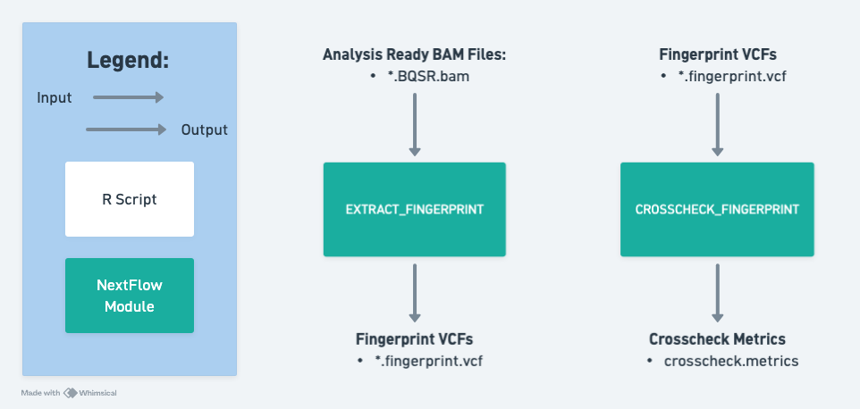

# 🧬 WESley: Whole Exome Sequencing Pipeline

## Overview
**WESley** is a modular [Nextflow](https://www.nextflow.io/) pipeline designed for analyzing **whole exome sequencing (WES)** data. It automates **data preprocessing**, **somatic mutation calling**, and **copy number variation (CNV)** analysis from raw FASTQ files of patient-derived tumor samples. The pipeline maintains HIPAA-compliance and reinforces reproducible workflows to support ongoing neuro-oncology research at UCLA.

---

## Table of Contents

- [Workflow Diagrams](#workflow-diagrams)
- [How To Run](#how-to-run-data-processing)
  - [Data Processing](#how-to-run-data-processing)
  - [Mutation Calling](#how-to-run-mutation-calling)
  - [Create Mutect2 PON](#how-to-run-mutation_callingnfcreate_m2_pon)
  - [CNV Calling](#how-to-run-cnvkitnfcnv_calling)
  - [Create CNVKit Normal](#how-to-run-cnvkitnfcreate_norm)
  - [Consensus Calling](#how-to-run-consensus-calling)
  - [Fingerprinting](#how-to-run-fingerprinting)
- [AWS HealthOmics](#aws-healthomics)
- [Docker & Containerization](#docker--containerization)
- [Requirements](#requirements)
- [Testing & CI/CD](#testing--cicd)
- [Outputs](#outputs)
- [Troubleshooting](#troubleshooting)
- [Contributors](#contributors)

---

## Workflow Diagrams
### Data Processing


### Mutation Calling


### Copy Number Calling


### Consensus Calling


### Fingerprinting


## How To Run (Data Processing)

### Run Data Processing Workflow:
```bash
nextflow -C /path/to/nextflow.config run data_processing.nf -entry DATA_PROCESSING -with-docker -with-trace \
--fastq_dir /path/to/batch-18/raw_fastqs \
--output_dir /path/to/batch-18/results \
--ref_dir /references \
--metadata /path/to/batch-18/metadata/seq_metadata_sheet.csv \
--seq_center "TCGB" \
--platform "Illumina_NovaSeqX"
```

**Script Parameters:**

| Flag            | Description |
|-----------------|-------------|
| `-C`            | Nextflow config file |
| `-entry`        | Workflow-specific name |
| `--with-docker` | Enables Docker container usage |
| `-with-trace`   | Generates trace logs for resource usage and execution profiling |
| `--fastq_dir`   | Directory containing raw FASTQ files |
| `--output_dir`  | Directory for pipeline outputs |
| `--ref_dir`     | Directory containing reference genomes and annotation databases |
| `--metadata`    | Sequencing Metadata in CSV Format |
| `--seq_center`  | Sequencing center name (e.g., `TCGB`) |
| `--platform`    | Sequencing platform (e.g., `Illumina_NovaSeqX`) |
| `--cpus`        | Number of CPUs to allocate for each process (default: 30) |

## How To Run (Mutation Calling)

### 1. Generate the Manifest

Use `make_mc_manifest.py` to generate the JSON manifest required by the mutation calling workflow. Two platforms are supported:

#### Local (filesystem)
* NOTE: Normal BAMs must be stored in the `normals/` subdirectory under `--bam_dir`

```bash
python make_mc_manifest.py --platform local \
  -d /path/to/batch-18/bams \
  -m /path/to/sequencing-metadata.xlsx \
  -o manifest.json
```

| Flag | Description |
|------|-------------|
| `--platform local` | Scan a local BAM directory |
| `-d, --bam_dir` | Directory containing tumor BAM files |
| `-m, --metadata` | Path to sequencing metadata sheet (Excel .xlsx) |
| `-o, --output` | Output path for the manifest JSON |

#### AWS HealthOmics Sequence Store
No metadata sheet required — tumor/normal classification and pairing are derived entirely from ReadSet metadata (`sampleId`, `subjectId`). Samples whose `sampleId` matches `BLD`, `NRM`, `CD45`, or `PBMC` are classified as normals; tumors and normals sharing the same `subjectId` are paired.

```bash
python make_mc_manifest.py --platform omics \
  --store_id <SEQUENCE_STORE_ID> \
  --region us-west-2 \
  -o manifest.json
```

| Flag | Description |
|------|-------------|
| `--platform omics` | Query a HealthOmics Sequence Store via boto3 |
| `--store_id` | HealthOmics Sequence Store ID |
| `--region` | AWS region of the Sequence Store |
| `-o, --output` | Output path for the manifest JSON |

### 2. Run Mutation Calling:

### On Local Workstations
```bash
# Set OncoKB API token via Nextflow secrets (only needs to be done once)
nextflow secrets set ONCOKB_API_KEY "your_actual_API_token"

# Run the pipeline
nextflow -C "/path/to/config" \
run mutation_calling.nf \
-with-docker -with-trace \
--output_dir "/path/to/batch-18/results" \
--ref_dir "/path/to/references" \
--samples manifest.json \
--interval_list "/path/to/references/KAPA_bait.interval_list" \
--cpus 30
```

**Workflow Parameters:**

| Flag             | Required | Description |
|------------------|----------|-------------|
| `--with-docker`  | Yes      | Enables Docker container usage |
| `-with-trace`    | No       | Generates trace logs for resource usage and execution profiling |
| `--output_dir`   | Yes      | Output directory for mutation calling results |
| `--ref_dir`      | Yes      | Directory containing reference genomes and annotation databases |
| `--samples`      | Yes      | Path to the JSON manifest generated by `make_mc_manifest.py` |
| `--interval_list`| Yes      | Path to interval list file for targeted sequencing regions |
| `--cpus`         | No       | Number of CPUs to allocate for each process (default: 30) |

**Note:** The `--bam_dir` parameter is used by `make_mc_manifest.py` for manifest generation only, not by the mutation calling workflow itself.

### On AWS HealthOmics

See the [AWS HealthOmics](#aws-healthomics) section for full setup instructions (authentication, workflow deployment, sequence store import). Once setup is complete:

```bash
# 1. Authenticate via okta-aws-cli (see AWS HealthOmics section)
# 2. Generate manifest from Sequence Store
python make_mc_manifest.py --platform omics \
  --store_id <STORE_ID> --region us-west-2 -o manifest.json

# 3. Upload manifest and start run (see AWS HealthOmics section)
```

## How To Run (mutation_calling.nf:CREATE_M2_PON)

This workflow creates a Mutect2 Panel of Normals (PON) from normal samples. The PON is used to filter out technical artifacts and germline variants during somatic mutation calling.

**Recommended:** Use at least 40 normal samples for robust PON creation.

```bash
nextflow -C "nextflow.config" \
    run "mutation_calling.nf" \
    -entry "CREATE_M2_PON" \
    -with-trace -with-docker \
    --output_dir "/path/to/output" \
    --ref_dir "/path/to/references" \
    --normal_dir "/path/to/normal/bams" \
    --interval_list "seqcap_hg38_capture_targets.interval_list"
```

**Workflow Parameters:**

| Flag             | Required | Description |
|------------------|----------|-------------|
| `--output_dir`   | Yes      | Output directory for PON files |
| `--ref_dir`      | Yes      | Directory containing reference genomes |
| `--normal_dir`   | Yes      | Directory containing normal BAM files (with .bai indices) |
| `--interval_list`| Yes      | Interval list file name (located in ref_dir) |
| `--cpus`         | No       | Number of CPUs to allocate (default: 30) |

**Output:**
- `{interval_list_basename}.pon.vcf.gz` - Panel of Normals VCF
- `{interval_list_basename}.pon.vcf.gz.tbi` - VCF index

## How To Run (cnvkit.nf:CNV_CALLING)

```bash
nextflow -C "nextflow.config" \
run "cnvkit.nf" \
-entry "CNV_CALLING" \
-with-trace -with-docker \
--bam_dir "/path/to/bams" \
--output_dir "/results/" \
--ref_dir "/path/to/references" \
--pooled_normal "normal.cnn" \
--cpus 40 \
--batch_name "wes-10"
```

**Script Parameters:**
| Flag             | Description |
|------------------|-------------|
| --bam_dir        | BAM file directory |
| --output_dir     | Directory to publish outputs |
| --ref_dir        | Path to the references folder |
| --pooled_normal  | Pooled normal reference file (CNN format) |
| --batch_name     | Batch name for output renaming |
| --cpus           | Number of CPUs to allocate (Default: 1) |

## How to Run (cnvkit.nf:CREATE_NORM)
```bash
nextflow -C "nextflow.config" \
run "cnvkit.nf" \
-entry "CREATE_NORM" \
-with-trace -with-docker \
--bam_dir "/path/to/bams" \
--output_dir "/results/" \
--ref_dir "/path/to/references" \
--capture_kit "seqcap-v3" \
--annotation "hg38_refFlat.txt" \
--targets "seqcap_hg38_capture_targets.bed" \
--cpus 39
```

**Script Parameters:**
| Flag             | Description |
|------------------|-------------|
| --bam_dir        | BAM file directory |
| --output_dir     | Directory to publish outputs |
| --ref_dir        | Path to the references folder |
| --cpus           | Number of CPUs to allocate (Default: 1) |
| --capture_kit    | Name of the capture kit used for sequencing |
| --seq_platform   | Name of the sequencing platform used |
| --annotation     | Gene annotation file in refFlat format (e.g., hg38_refFlat.txt) |
| --targets        | BED file containing capture target regions |
| --ref_genome     | Reference genome used (Default: Homo_sapiens_assembly38.fasta) |
| --help           | Display the help message |

## How To Run (Fingerprinting)

The fingerprinting workflow uses [Picard](https://broadinstitute.github.io/picard/) to verify sample identity across BAMs. It provides two independent entry points — run `EXTRACT` first to generate per-sample fingerprint VCFs, then `CROSSCHECK` to compare them all-vs-all.

### EXTRACT — BAMs → per-sample fingerprint VCFs

Runs Picard `ExtractFingerprint` on each BAM and publishes one VCF per sample. BAMs must follow the naming convention `<sample_id>.BQSR*.bam`.

```bash
nextflow -C "/path/to/config" \
  run fingerprint.nf \
  -entry EXTRACT \
  -with-docker -with-trace \
  --bam_dir "/path/to/bams" \
  --output_dir "/path/to/results" \
  --ref_dir "/path/to/references" \
  --haplotype_map "hg38_chr1-22XY.map"
```

**Parameters:**

| Flag               | Required | Description |
|--------------------|----------|-------------|
| `--bam_dir`        | Yes      | Directory containing BQSR BAM files (searched recursively) |
| `--output_dir`     | Yes      | Output directory; VCFs are written to `{output_dir}/fingerprint/vcfs/` |
| `--ref_dir`        | Yes      | Directory containing reference genomes and the haplotype map |
| `--haplotype_map`  | Yes      | Haplotype map file name inside `ref_dir` (e.g. `hg38_chr1-22XY.map`) |
| `--cpus`           | No       | Number of CPUs (default: 1) |

### CROSSCHECK — fingerprint VCFs → all-vs-all identity metrics

Runs Picard `CrosscheckFingerprints` across all VCFs in a directory (searched recursively). Use the VCFs produced by `EXTRACT`, or point to any pre-existing fingerprint VCFs.

```bash
nextflow -C "/path/to/config" \
  run fingerprint.nf \
  -entry CROSSCHECK \
  -with-docker -with-trace \
  --vcf_dir "/path/to/results/fingerprint/vcfs" \
  --output_dir "/path/to/results" \
  --ref_dir "/path/to/references" \
  --haplotype_map "hg38_chr1-22XY.map"
```

**Parameters:**

| Flag               | Required | Description |
|--------------------|----------|-------------|
| `--vcf_dir`        | Yes      | Directory containing fingerprint VCFs (searched recursively) |
| `--output_dir`     | Yes      | Output directory; metrics are written to `{output_dir}/fingerprint/comparison-metrics/` |
| `--ref_dir`        | Yes      | Directory containing reference genomes and the haplotype map |
| `--haplotype_map`  | Yes      | Haplotype map file name inside `ref_dir` (e.g. `hg38_chr1-22XY.map`) |
| `--cpus`           | No       | Number of CPUs (default: 1) |

**Output:** `crosscheck.metrics` — a tab-separated Picard metrics file with LOD scores for every pair of samples. Pairs with `LOD_SCORE < -5` (the pipeline threshold) are flagged as unexpected mismatches.

## How To Run (Consensus Calling)
```bash
# Set OncoKB API token via Nextflow secrets (only needs to be done once;
# skip if already set from Mutation Calling)
nextflow secrets set ONCOKB_API_KEY "your_actual_API_token"

# Run the pipeline
nextflow run consensus_calling.nf --with-docker -with-trace \
--base_dir "/path/to/batch-18" \
--ref_dir "/path/to/references" \
--cpus 30
```

**Script Parameters:**

| Flag             | Description |
|------------------|-------------|
| `--with-docker`  | Enables Docker container usage |
| `-with-trace`    | Generates trace logs for resource usage and execution profiling |
| `--base_dir`     | Base directory for batch data (e.g., `wes-batch-18`) |
| `--ref_dir`      | Directory containing reference genomes and annotation databases |
| `--cpus`         | Number of CPUs to allocate for each process |

## AWS HealthOmics

WESley supports running the mutation calling workflow on [AWS HealthOmics](https://aws.amazon.com/omics/). The pipeline auto-detects the HealthOmics environment via the `AWS_WORKFLOW_RUN` environment variable and loads `mutation_calling/conf/omics.config`, which overrides:

> **AWS Console:** https://uclahealth.okta.com/ — Default region: `us-west-2`

### AWS CLI Authentication

HealthOmics requires short-lived credentials via Okta. Run this before any AWS CLI commands — credentials expire each session.

```bash
# Install okta-aws-cli (one-time)
brew install okta-aws-cli  # macOS

# Authenticate (prompts for UCLA 2FA/Duo)
okta-aws-cli --org-domain mylogin.it.uclahealth.org --oidc-client-id <OIDC_CLIENT_ID>

# Export the printed credentials
export AWS_ACCESS_KEY_ID=***
export AWS_SECRET_ACCESS_KEY=***
export AWS_SESSION_TOKEN=***
```

### Deploying the Workflow (one-time setup)

Only needs to be done once, or when pipeline code changes.

```bash
# Zip the workflow
cd nextflow_automation/
zip -r /tmp/mutation_calling.zip mutation_calling/

# Create the HealthOmics private workflow
WORKFLOW_ID=$(aws omics create-workflow \
  --name WESley-mutation-calling \
  --definition-zip fileb:///tmp/mutation_calling.zip \
  --engine NEXTFLOW \
  --query 'id' --output text)

# Verify it's active
aws omics get-workflow --id $WORKFLOW_ID --query 'status'
```

Alternatively, create via **AWS Console → HealthOmics → Private Workflows → Create Workflow** (upload the zip, select Nextflow engine).

### Sequence Store Setup

BAMs must be imported into a HealthOmics Sequence Store before running. Create a Sequence Store via the console with an S3 fallback bucket, then import BAMs:

```bash
# Upload BAMs to S3 first
aws s3 cp ./bams/ s3://your-bucket/bams/ --recursive --include "*.bam"

# Create an import manifest (indexes are generated automatically — BAMs only)
cat > import_manifest.json << 'EOF'
[
  {
    "subjectId": "90",
    "sampleId": "PT090",
    "sourceFileType": "BAM",
    "sourceFiles": { "source1": "s3://your-bucket/bams/PT090.BQSR.bam" },
    "referenceArn": "arn:aws:omics:us-west-2:<ACCOUNT>:referenceStore/<REF_STORE_ID>/reference/<REF_ID>"
  }
]
EOF
```

Then import via **Console → Sequence Store → Import Read Sets**, selecting `ucla-dgit-omics-service-role` as the service role.

### ECR — Custom Container Images

HealthOmics pulls containers from ECR. To push updated custom images:

```bash
# Build and push to Docker Hub first
docker build -t e10m/<image>:<version> -f containerization/dockerfiles/<image>.Dockerfile .
docker push e10m/<image>:<version>

# Push to ECR (adjust image names in the script)
bash containerization/scripts/ecr_push.sh

# Grant HealthOmics pull access to the ECR repo
aws ecr set-repository-policy --repository-name <repo> --region us-west-2 \
  --policy-text '{"Version":"2012-10-17","Statement":[{"Effect":"Allow","Principal":{"Service":"omics.amazonaws.com"},"Action":["ecr:GetDownloadUrlForLayer","ecr:BatchGetImage","ecr:BatchCheckLayerAvailability"]}]}'
```

- **Reference paths** — switched to S3 (`s3://omics-sequence-971422717605-4-8-2026/references/`)
- **Container images** — switched to ECR (`971422717605.dkr.ecr.us-west-2.amazonaws.com/...`)
- **Output directory** — set to `/mnt/workflow/pubdir`
- **OncoKB secrets** — retrieved automatically from AWS Secrets Manager (`oncokb-api-key`) rather than Nextflow secrets

### OncoKB Token — Local vs HealthOmics

| Mode | How the token is stored | Setup |
|------|------------------------|-------|
| Local | Nextflow secrets (`~/.nextflow/secrets/`) | `nextflow secrets set ONCOKB_API_KEY "your_token"` |
| HealthOmics | AWS Secrets Manager (`oncokb-api-key`) | Create the secret once; retrieved automatically at runtime |

> **Note:** OncoKB API tokens expire every 6 months. A GitHub Actions workflow (`test-api.yml`) checks token validity weekly and fails loudly on expiry.

> **IAM requirement:** The HealthOmics service role must have `secretsmanager:GetSecretValue` permission on the `oncokb-api-key` secret.

### Submitting a Run

```bash
# 1. Authenticate (credentials expire each session)
okta-aws-cli --org-domain mylogin.it.uclahealth.org --oidc-client-id <OIDC_CLIENT_ID>
export AWS_ACCESS_KEY_ID=*** AWS_SECRET_ACCESS_KEY=*** AWS_SESSION_TOKEN=***

# 2. Generate manifest from Sequence Store
python make_mc_manifest.py --platform omics \
  --store_id <STORE_ID> --region us-west-2 -o manifest.json

# 3. Upload manifest to S3
aws s3 cp manifest.json s3://<BUCKET>/manifests/

# 4. Start HealthOmics run (CLI)
aws omics start-run \
  --workflow-id <WORKFLOW_ID> \
  --output-uri s3://<BUCKET>/outputs/ \
  --role-arn arn:aws:iam::<ACCOUNT>:role/ucla-dgit-omics-service-role \
  --parameters '{"samples":"s3://.../manifest.json","interval_list":"s3://.../KAPA_bait.interval_list"}' \
  --region us-west-2
```

Alternatively, start via **Console → HealthOmics → Runs → Start Run**, selecting the service role and uploading a parameters JSON.

## Docker & Containerization

WESley uses Docker containers to ensure reproducible, isolated analysis environments. The pipeline leverages a mix of public [BioContainers](https://biocontainers.pro/) images and custom-built images.

### Setup
```bash
# Pull all Docker images (one-time setup)
cd containerization/
docker compose pull
```

### Container Overview

| Workflow | Key Containers |
|----------|----------------|
| Data Processing | `broadinstitute/gatk:4.2.0.0`, `e10m/bwa-and-samtools`, `biocontainers/fastqc`, `multiqc/multiqc` |
| Mutation Calling | `broadinstitute/gatk:4.2.0.0`, `quay.io/biocontainers/muse`, `e10m/varscan2`, `e10m/vep`, `e10m/oncokb` |
| CNV Calling | `quay.io/biocontainers/cnvkit:0.9.10` |
| Consensus Calling | `e10m/vep`, `e10m/oncokb`, `e10m/vcf2maf`, `staphb/bcftools` |
| Fingerprinting | `broadinstitute/picard:3.4.0` |

### Custom Images
Custom Dockerfiles are located in `containerization/dockerfiles/` for tools requiring specific configurations:
- **bwa-and-samtools** - Combined BWA 0.7.17 + SAMtools 1.10
- **vep** - Ensembl VEP with pre-cached GRCh38 variant databases
- **oncokb** - OncoKB annotator v3.0.0
- **vcf2maf** - VCF-to-MAF conversion tools
- **varscan2** - VarScan v2.4.3 with Java runtime

### Volume Mounting
All workflows mount the reference directory at `/references` inside containers. This is configured automatically via `nextflow.config`:
```groovy
containerOptions = "-v ${params.ref_dir}:/references"
```

## Requirements

### System Requirements
- **Memory**: 64 GB RAM recommended
- **Storage**: At least 2 TB free space per 10-sample batch
- **CPU**: Multi-core processor (32 cores minimum is recommended)

### API Requirements
- **OncoKB API Token**: An [API token](https://www.oncokb.org/api-access) is required from OncoKB
  - NOTE: The token expires every 6 months

### Software Dependencies

#### General
| Software        | Version  | Purpose |
|-----------------|----------|---------|
| Nextflow        | 25.04.6  | Workflow management |
| Docker          | 18.09.7  | Containerization |
| Python          | 3.10     | Scripting and automation |
| R               | 4.3.1    | Statistical analysis |
| Ubuntu          | 20.04    | Shell & data manipulation |

#### Data Processing
| Software        | Version  | Purpose |
|-----------------|----------|---------|
| Trim Galore     | 0.6.6    | Adapter trimming |
| Cutadapt        | 2.8      | Sequence trimming |
| BBMap           | 38.06    | Read mapping and QC |
| SAMtools        | 1.10     | BAM file manipulation |
| BWA             | 0.7.17   | Read alignment |
| FastQC          | v0.11.9  | Quality control |
| MultiQC         | v1.30    | Quality control aggregation |

#### Mutation Calling
| Software        | Version  | Purpose |
|-----------------|----------|---------|
| GATK / Mutect2  | 4.2.0.0  | Variant calling |
| Ensembl VEP     | 115      | Variant annotation |
| vcf2maf.pl      | 1.6.19   | VCF to MAF conversion |
| MuSE            | v1.0rc   | Somatic mutation detection |
| Openjdk/Java    | 11.0.27  | Java runtime environment |
| OncoKB          | 3.0.0    | Clinical annotation |
| VarScan         | v2.4.3   | Variant detection |
| bcftools        | 1.10.2   | BCF file manipulation |

#### Copy Number Calling
| Software        | Version  | Purpose |
|-----------------|----------|---------|
| CNVKit          | 0.9.10   | Copy Number Calling |

#### Consensus Calling
| Software        | Version  | Purpose |
|-----------------|----------|---------|
| Ensembl VEP     | 115      | Variant annotation |
| vcf2maf.pl      | 1.6.19   | VCF to MAF conversion |
| OncoKB          | 3.0.0    | Clinical annotation |
| bcftools        | 1.10.2   | BCF file manipulation |

#### Fingerprinting
| Software        | Version  | Purpose |
|-----------------|----------|---------|
| Picard          | 3.4.0    | Sample identity verification (ExtractFingerprint / CrosscheckFingerprints) |

### Requirements to Run
- Ensure the proper references and metadata are downloaded
- Docker, Nextflow, and Java installed
  - eg:
    ```bash
    conda install conda-forge/label/cf201901::openjdk=11.0.27
    conda install bioconda::nextflow=25.04.6
    conda install conda-forge::docker
    ```
- FASTQ files need to be compressed (.gz)
- Pull all Docker images
  - `$ cd containerization/`
  - `$ docker compose pull`

### Resource Management
The pipeline automatically scales resource allocation based on available system resources. Monitor system usage during execution and adjust `--cpus` parameter as needed.

## Testing & CI/CD

### nf-test Framework
WESley uses [nf-test](https://www.nf-test.com/) for module-level unit testing. Tests validate individual process functionality before integration into complete workflows.

**Running Tests Locally:**
```bash
# All commands must be run from nextflow_automation/ directory
cd nextflow_automation

# List all available tests
nf-test list

# Run specific test
nf-test test tests/data_processing/modules/align.nf.test

# Run all data processing tests
nf-test test tests/data_processing/modules/*.nf.test

# Run all mutation calling tests
nf-test test tests/mutation_calling/modules/mutect2/*.nf.test
```

**Test Organization:**
- Configuration: `nextflow_automation/nf-test.config`
- Shared settings: `tests/shared-test.config`
- Test data: `nextflow_automation/test-data/`

### GitHub Actions CI/CD
Five workflows automatically validate code on pull requests:

| Workflow | Trigger | Purpose |
|----------|---------|---------|
| **Nextflow Linter** | PRs to main | Validates code style and Nextflow best practices |
| **Data Processing Tests** | PRs & branch pushes | Tests 7 modules (TRIM, FASTQC, BWA_ALIGN, MARK_DUPES, SET_TAGS, RECAL_BASES, APPLY_BQSR) |
| **Mutation Calling Tests** | PRs & branch pushes | Tests 5 Mutect2 modules (MUTECT2_CALL, GET_PILEUP_SUMMARIES, CALCULATE_CONTAMINATION, LEARN_READ_ORIENTATION, FILTER_MUTECT_CALLS) |
| **Make MC Manifest Tests** | PRs & branch pushes | pytest unit + integration tests for `make_mc_manifest.py` |
| **OncoKB API Check** | Weekly (Mondays) + manual | Validates OncoKB token via curl; alerts on expiry (HTTP 401) |

Tests run in parallel using GitHub Actions matrix strategy for faster CI/CD execution.

## Outputs
**Key Output Files:**

| File Type | Location | Description |
|-----------|----------|-------------|
| **Analysis-ready BAMs** | `preprocessing/analysis_ready_bams/` | Quality-controlled, recalibrated BAM files ready for variant calling |
| **VEP-annotated VCFs** | `mutation_calls/{caller}/vep_annotation/` | Variant calls annotated with Variant Effect Predictor |
| **OncoKB-annotated MAFs** | `mutation_calls/{caller}/oncokb_annotation/` | Mutation calls in MAF format with OncoKB clinical annotations |
| **Segmentation files** | `cnv_calling/segmentation/` | Copy number variant segments in SEG format |
| **Fingerprint VCFs** | `fingerprint/vcfs/` | Per-sample fingerprint VCFs produced by `EXTRACT` |
| **Crosscheck metrics** | `fingerprint/comparison-metrics/crosscheck.metrics` | All-vs-all LOD score matrix from `CROSSCHECK` |

### Logs
All execution logs and resource usage reports:
- `trace.txt` - Detailed execution trace with resource usage
- `nextflow.log` - Main pipeline log file

## Troubleshooting

### Getting Help
1. Check the Nextflow log: `tail -f .nextflow.log`
2. Review process-specific logs in `work/` directories
    - `cat .command.log`: Entire log of stdout for specific task
    - `cat .command.err`: Error log for the specific task
    - `cat .command.run`: The actual bash script that was executed
    - `ls -al`: Check for all files in the work directory
3. Validate input metadata format matches expected schema
4. Ensure Docker containers can access mounted directories
5. Ensure `reference` folder is downloaded and accessible via Nextflow params

## Contributors
- **Dien Ethan Mach** - Pipeline development and maintenance
- **Cassidy Andrasz** - Testing and optimization
- **Henan Zhu** - Original pipeline development

---

**For questions or support, please contact:** dienethanmach@gmail.com
