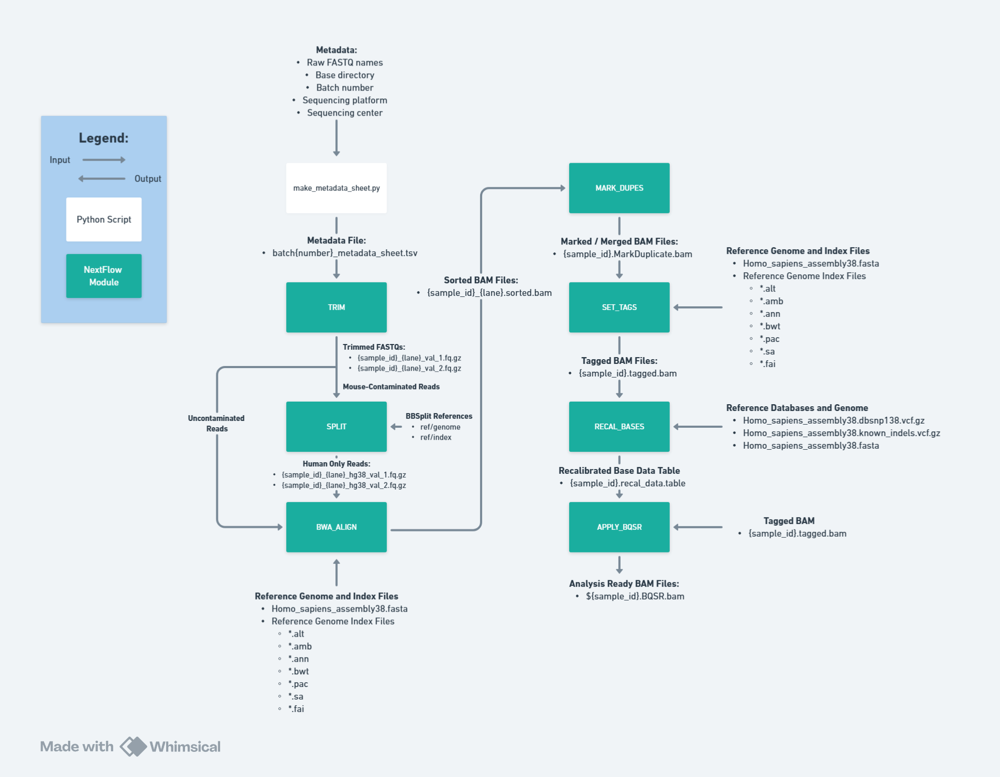
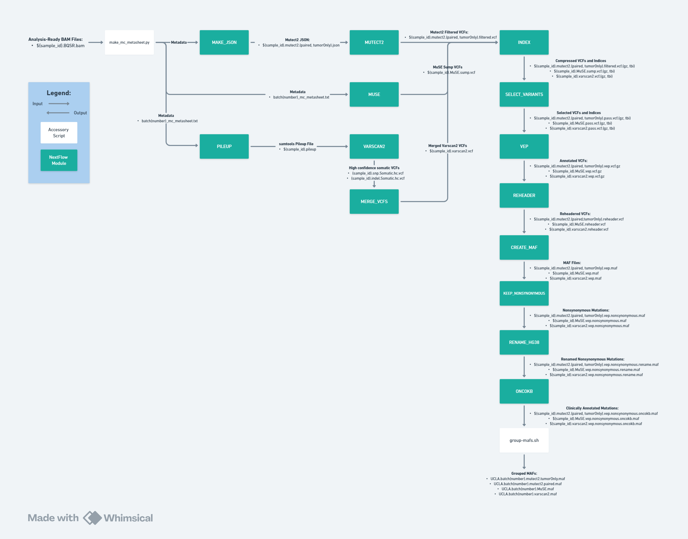

# 🧬 WESley: Whole Exome Sequencing Pipeline

## Overview
**WESley** is a modular [Nextflow](https://www.nextflow.io/) pipeline designed for analyzing **whole exome sequencing (WES)** data. It automates **data preprocessing**, **somatic mutation calling**, and **copy number variation (CNV)** analysis from raw FASTQ files of patient-derived samples.

---
## Workflow Diagrams
### Data Processing


### Mutation Calling


### Copy Number Calling


### Consensus Calling
* WIP

## How To Run (Data Processing)

### 1. Generate the Metadata Sheet

Use the `make_metadata_sheet.py` script to generate a `.tsv` metadata file required for downstream Nextflow processes.

```bash
python make_metadata_sheet.py \
-f "/media/graeberlab/wdtwo/dmach/test_fastqs/nf-batch-18/raw_fastqs" \
-b 18 \
-p "Illumina_NovaSeq6000" \
-s "TCGB" \
-m "/media/graeberlab/wdtwo/dmach/wes_pipeline/revamp_files/nextflow_automation/data_processing/metadata/SequencingPrep.xlsx" \
-o "/media/graeberlab/wdtwo/dmach/wes_pipeline/revamp_files/nextflow_automation/data_processing"
```

**Script Parameters:**
| Flag | Description |
|------|-------------|
| -f   | Directory containing raw FASTQ files |
| -b   | Batch number |
| -p   | Sequencing platform (e.g., Illumina_NovaSeq6000) |
| -s   | Sequencing center (e.g., TCGB) |
| -m   | Path to metadata prep sheet (Excel .xls) |
| -o   | Output directory for the generated .tsv |

### 2. Run Data Processing Workflow:
```bash
nextflow run data_processing.nf --with-docker -with-trace \
--base_dir /media/graeberlab/wdtwo/dmach/test_fastqs/nf-batch-18 \
--ref_dir /media/graeberlab/wdtwo/dmach/references \
--metadata /media/graeberlab/wdtwo/dmach/wes_pipeline/revamp_files/nextflow_automation/batch18_metadata_sheet.tsv \
--cpus 35
```

**Script Parameters:**

| Flag            | Description |
|-----------------|-------------|
| `--with-docker` | Enables Docker container usage |
| `-with-trace`   | Generates trace logs for resource usage and execution profiling |
| `--base_dir`    | Base directory for batch data (e.g., `wes-batch-18`) |
| `--ref_dir`     | Directory containing reference genomes and annotation databases |
| `--metadata`    | Path to the metadata sheet generated by `make_metadata_sheet.py` |
| `--cpus`        | Number of CPUs to allocate for each process |

## How To Run (Mutation Calling)

### 1. Generate the Metadata Sheet

Use the `make_mc_metasheet.py` script to generate a `.tsv` metadata file required for downstream Nextflow processes.
* NOTE: Ensure normal BAMs are stored in the ../bam_dir/normals folder

```bash
python make_mc_metasheet.py \
--bam_dir /media/graeberlab/wdtwo/dmach/truncated-bams \
-b 123 \
-o ./ \
-m /media/graeberlab/wdtwo/dmach/wes_pipeline/revamp_files/nextflow_automation/mutation_calling/metadata/Sequencing_Metadata_MAIN.xlsx
```

**Script Parameters:**
| Flag      | Description |
|-----------|-------------|
| --bam_dir | Directory containing .bam files |
| -b        | Batch number |
| -m        | Path to metadata prep sheet (Excel .xls) |
| -o        | Output directory for the generated .tsv |

### 2. Run Mutation Calling:

```bash
# Set OncoKB API token from file
export ONCOKB_TOKEN=$(cat /path/to/references/oncokb-token.txt)

# Run the pipeline
nextflow run mutation_calling.nf --with-docker -with-trace \
--base_dir "/media/graeberlab/wdtwo/dmach/truncated-bams" \
--batch_number 123 \
--app_dir "/media/graeberlab/wdtwo/app"
```

**Script Parameters:**

| Flag             | Description |
|------------------|-------------|
| `--with-docker`  | Enables Docker container usage |
| `-with-trace`    | Generates trace logs for resource usage and execution profiling |
| `--base_dir`     | Base directory for batch data (e.g., `wes-batch-18`) |
| `--ref_dir`      | Directory containing reference genomes and annotation databases |
| `--metadata`     | Path to the metadata sheet generated by `make_metadata_sheet.py` |
| `--cpus`         | Number of CPUs to allocate for each process |
| `--batch_number` | Batch number |
| `--app_dir`      | Directory to all the Java JARs / accessory software (eg: Mutect2.wdl) |

## How To Run (CNV Calling)

```bash
nextflow run cnvkit.nf \
--with-docker -with-trace \
--base_dir /media/graeberlab/wdtwo/dmach/batch20-bams/ \
--ref_dir /media/graeberlab/wdtwo/dmach/references \
--batch_number 20
```

**Script Parameters:**
| Flag             | Description |
|------------------|-------------|
| --base_dir       | Base Directory of the BAM Files |
| --batch_number   | Batch number |
| --ref_dir        | Path to the references folder |
| --cpus           | Number of CPUs to allocate |

## Requirements

### System Requirements
- **Memory**: Minimum 32 GB RAM, 64 GB RAM recommended
- **Storage**: At least 2 TB free space per 10-sample batch
- **CPU**: Multi-core processor (32 cores minimum is recommended)

### Software Dependencies

#### General
| Software        | Version  | Purpose |
|-----------------|----------|---------|
| Nextflow        | 24.10.5  | Workflow management |
| Docker          | 18.09.7  | Containerization |
| Python          | 3.6.10   | Scripting and automation |
| R               | 4.3.1    | Statistical analysis |
| Ubuntu          | 20.04    | Shell & data manipulation |

#### Data Processing
| Software        | Version  | Purpose |
|-----------------|----------|---------|
| Trim Galore     | 0.6.6    | Adapter trimming |
| Cutadapt        | 2.8      | Sequence trimming |
| BBMap           | 38.06    | Read mapping and QC |
| SAMtools        | 1.10     | BAM file manipulation |
| BWA             | 0.7.17   | Read alignment |

#### Mutation Calling 
| Software        | Version  | Purpose |
|-----------------|----------|---------|
| GATK / Mutect2  | 4.2.0.0  | Variant calling |
| MuSE            | 1.0      | Somatic mutation detection |
| VEP             | 2016–2022| Variant annotation |
| CNVkit          | 0.9.10   | Copy number analysis |
| vcf2maf.pl      | 1.6.17   | VCF to MAF conversion |
| MuSE            | v1.0rc   | Somatic mutation detection |
| Openjdk/Java (Mutect2)    | 11.0.1  | Java runtime environment |
| Openjdk/Java (VarScan2)    | 11.0.27  | Java runtime environment |
| Cromwell        | 60       | Mutect2.wdl execution |
| OncoKB          | 3.0.0    | Therapeutic annotation |
| VarScan         | v2.4.3   | Variant detection |
| Ensembl VEP     | 103      | Variant effect prediction |

### R Package Dependencies

| R Package      | Version | Purpose |
|----------------|---------|---------|
| R               | 4.3.1    | Statistical analysis |
| dplyr          | 1.1.4   | Data manipulation and filtering |
| biomaRt        | 2.60.1  | Accessing Ensembl biomart for gene annotations |
| readxl         | 1.4.5   | Reading Excel files |
| GenomicRanges  | 1.56.2  | Genomic interval operations and overlap analysis |
| ggplot2        | 3.5.2   | Data visualization |
| purrr          | 1.0.4   | Functional programming, specifically reduce() for joining data frames |
| CNTools        | 1.60.0  | Copy number analysis tools |
| writexl        | 1.5.4   | Writing Excel files |
| data.table     | 1.17.2  | Fast data manipulation, specifically fread() function |

### Requirements to Run
- References folder
- Docker, Nextflow, and Java 11.0.1 installed on a conda environment
  - conda install conda-forge/label/cf201901::openjdk=11.0.1
  - conda install bioconda::nextflow=24.10.5
  - conda install conda-forge::docker
- FASTQ files need to be compressed (.gz)
- Install cromwell-60.jar, gatk-package-4.2.0.0-local.jar, and mutect2.wdl in `$app_dir`

## Nextflow Features & Quirks

### Resume Feature
Use the `resume` flag to restart the pipeline from where it left off after interruption:
```bash
nextflow run <pipeline.nf> -resume
```
This feature saves significant computational time by skipping completed processes and only re-running failed or modified steps.

**NOTE**: This requires the Nextflow work directory and cache

### Work Directory
Nextflow creates a `work/` directory containing temporary files and intermediate outputs. This directory can become quite large (100GB+) and should be cleaned periodically:
```bash
# Clean work directory after successful completion
nextflow clean -f

# Alternative method
sudo rm -rf ./work/
```

* NOTE: Deleting the `work/` directory no longer allows you to run the `-resume` method. The pipeline will run from the beginning.

### Resource Management
The pipeline automatically scales resource allocation based on available system resources. Monitor system usage during execution and adjust `--cpus` parameter as needed.

## Outputs

### Primary Outputs
The main results are organized in the following structure:
```
INSERT DIRECTORY TREE HERE
```

**Key Output Files:**
- WORK IN PROGRESS

### Logs
All execution logs and resource usage reports:
- `trace.txt` - Detailed execution trace with resource usage
- `timeline.html` - Interactive execution timeline
- `report.html` - Comprehensive pipeline execution report
- `nextflow.log` - Main pipeline log file

## Troubleshooting

### Getting Help
1. Check the Nextflow log: `tail -f .nextflow.log`
2. Review process-specific logs in `work/` directories
    - `cat .command.log`: Entire log of stdout for specific task
    - `cat .command.err`: Error log for the specific task
    - `cat .command.run`: The actual bash script that was executed
    - `ls -al`: Check for all files in the work directory
3. Validate input metadata format matches expected schema
4. Ensure Docker containers can access mounted directories
5. Ensure `reference` and `app` folders are downloaded and accessible via Nextflow params

## Citation
If you use WESley in your research, please cite:
* WIP

## Contributors
- **Dien Ethan Mach** - Pipeline development and maintenance
- **Cassidy Andrasz** - Testing and optimization
- **Henan Zhu** - Original pipeline development

---

**For questions or support, please contact:** demach@mednet.ucla.edu